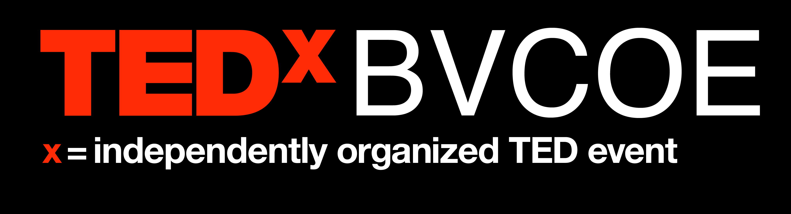

# tedxtemplate
A template for your TEDx (or TED) event.

# 


# Usage

## Quick method 
Download zip copy and make changes according to your tedx event

## Git Method ( to use github hosting as well)
1. Fork this repo
2. clone your forked repo ``` git clone repo_url ```
3. update ```CNAME``` file with your domain
4. Push your changes to your forked repo
